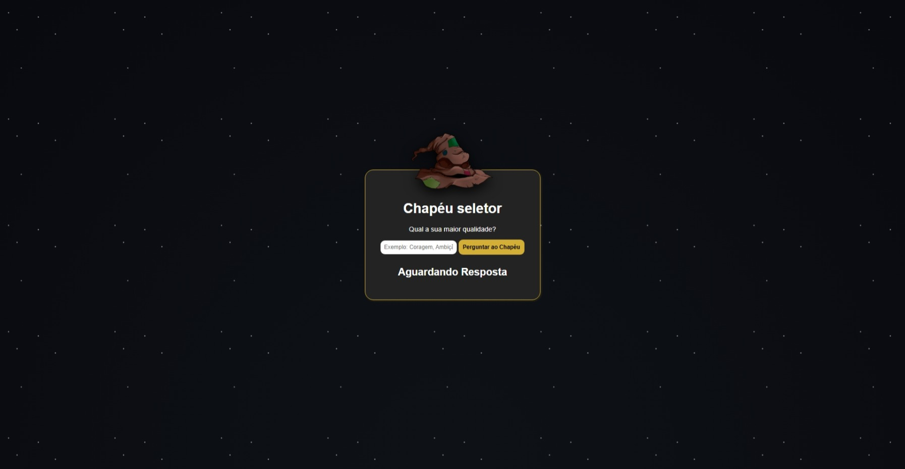
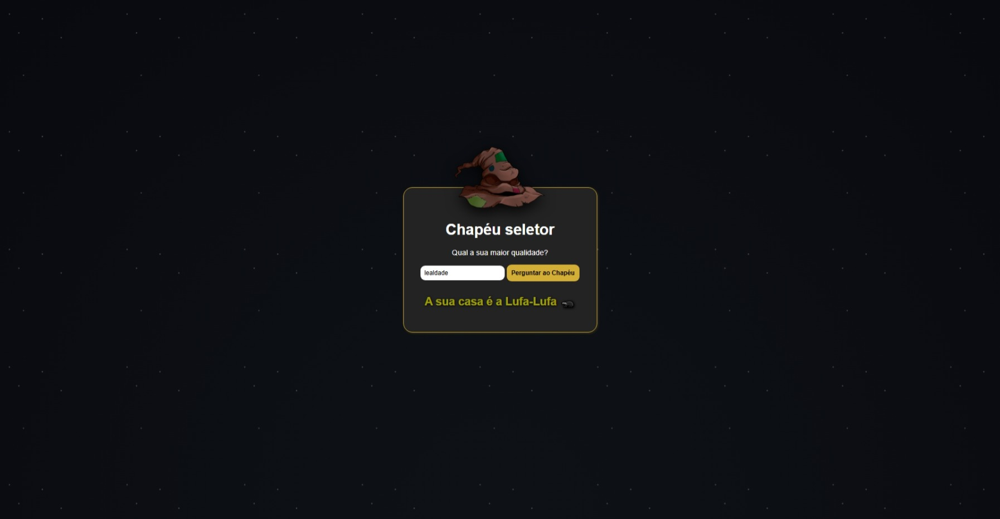

# 🧙‍♂️ Chapéu Seletor

Bem-vindo ao projeto **Chapéu Seletor**! Uma aplicação web interativa e mágica inspirada no universo de Harry Potter, desenvolvida para selecionar a casa ideal de Hogwarts com base nas características do usuário.

🔗 **Link do repositório:** [https://github.com/Myl8na/chapeuSeletor](https://github.com/Myl8na/chapeuSeletor)

---

## 📸 Preview do Projeto



---

## 📜 Sobre o Projeto

Este é um projeto **concluído** focado no desenvolvimento front-end. A ideia principal é simular o famoso Chapéu Seletor: o usuário insere uma característica marcante e, a partir dessa palavra-chave, a aplicação revela a qual casa de Hogwarts ele pertence.

## ✨ Funcionalidades

O programa identifica a casa correta quando o usuário digita uma das seguintes palavras-chave:

* 🦁 **Coragem** -> Grifinória (Gryffindor)
* 🐍 **Ambição** -> Sonserina (Slytherin)
* 🦅 **Inteligencia** -> Corvinal (Ravenclaw)
* 🦡 **Lealdade** -> Lufa-Lufa (Hufflepuff)

> **Nota:** O sistema reage a essas palavras específicas para fazer a "mágica" acontecer na tela.

### 🏠 Resultado das Casas



---

## 🛠️ Tecnologias Utilizadas

Este projeto foi construído utilizando as seguintes tecnologias e ferramentas de design:

**Desenvolvimento:**
* **HTML5** - Estruturação semântica do conteúdo.
* **CSS3** - Estilização, layout e animações visuais.
* **JavaScript** - Lógica de programação e interatividade.

**Design e Protótipagem:**
* **Figma** - Criação do layout, wireframes e protótipos da interface.
* **Adobe Photoshop** - Edição e tratamento das imagens utilizadas no projeto.

---

## 🚀 Como Executar o Projeto

Como é um projeto focado em Front-end estático, é muito simples rodá-lo na sua máquina:

1. Faça o clone deste repositório:
   ```bash
   git clone [https://github.com/Myl8na/chapeuSeletor.git](https://github.com/Myl8na/chapeuSeletor.git)
